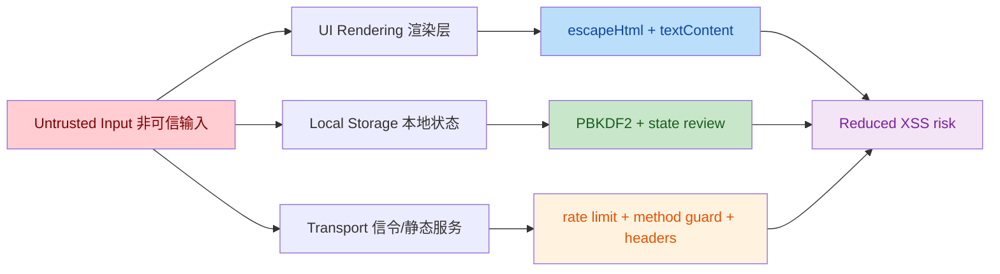

# Security Audit Report 独数九宫格 v1

File Name: `Security_Audit_Report_DushuJiugongge_v1.md`
Project Root: `d:\独数九宫格`
Audit Date: `2026-06-01`
Auditor: `GPT-5.4 Universal Security Auditor Agent`

## 1. Executive Summary 执行摘要

- Overall Risk Level 总体风险等级: `Medium`
- Critical / High Findings 关键/高危问题数量: `Critical 0 / High 3`
- Remediation Status 修复状态: `High 3 已修复, Medium 3 已修复, Residual 2 未完全收敛`
- Production Readiness 生产就绪结论:
  - 中文: 当前代码中不存在本轮确认且未修复的 Critical 级漏洞；不存在本轮确认且未修复的 High 级代码缺陷。存在架构级残余风险，主要是客户端本地状态可篡改、内联脚本导致 CSP 仍需保留 `'unsafe-inline'`。在未完成后续收敛前，不建议直接暴露到不可信公网。
  - English: No unremediated Critical or High code-level issue confirmed in this audit remains open. Residual architectural risk exists because client-side state is tamperable and CSP still depends on `'unsafe-inline'`. Public Internet deployment is not recommended until those residuals are closed.

## 2. Methodology 审计方法论

- Review Depth 审计深度: `White-box`
- Techniques 使用技术:
  - Static review 静态审计: full-folder grep/read review for sinks, storage, transport, and trust boundaries
  - Manual code review 人工审查: DOM XSS, storage handling, opener/postMessage, path traversal, rate limiting, auth state flow
  - Dynamic validation 动态验证: `node --check signaling-server.mjs`, `node --check static-server.mjs`
  - IDE diagnostics 编辑器诊断: `GetDiagnostics` on modified files
  - Threat model 威胁建模: browser-local attacker, malicious imported ledger, cross-window abuse, LAN abuse of signaling/static servers
- Toolchain & Versions 工具链与版本:
  - Node.js `v25.2.1`
  - `ws` dependency `^8.21.0`
  - VS Code diagnostics
  - Custom repository search / file read / patch application tooling
- Limitations 局限性:
  - Browser runtime fuzzing and real network replay were not executed in this environment.
  - Supabase/RLS/server-side policy definitions are not present in this repository, so backend authorization cannot be proven secure from available evidence.

## 3. Trust Model 信任模型

- Centralized Dependencies 中心化依赖:
  - `window.supabaseInstance` is an external trust anchor outside this repository.
  - Browser `localStorage` / `IndexedDB` store activation state, session state, and ledger state.
  - `signaling-server.mjs` is a centralized rendezvous point for peers.
- Single Points of Failure 单点:
  - Client-side activation flags: `mayiju_access`, `aim2m_activated`
  - Local identity cache: `currentUser`, `mayiju.session`, `mayiju.profile`
  - External backend policy correctness for `users`, `donations`, `activation_codes`, `gas_transfer_log`
- User Trust Assumptions 用户信任假设:
  - The browser device is trusted not to tamper with local state.
  - Imported ledger JSON is treated as untrusted and now partially sanitized, but business integrity still depends on local user choices.

## 4. Core Logic Security 核心逻辑安全

- Registration path 注册链路:
  - Password material was previously stored directly in `password_hash`; this created direct credential exposure if browser-side or backend tables were read.
  - It is now transformed into PBKDF2-derived material before persistence.
- Ledger import/export path 账本导入导出:
  - Imported ledger content can influence UI rendering and local identity restoration.
  - Current code escapes user-controlled strings in main visible report areas and conflict previews.
- Donation/activation path 捐赠与激活链路:
  - Activation still depends on client-visible state and local markers; this is functionally convenient but not strong authorization.
- Transport path 通讯链路:
  - Signaling now enforces room format, peer format, payload size, room capacity, and per-window message rate.

## 5. Data Security 数据安全

- At Rest 静态数据:
  - Sensitive browser state exists in `localStorage` and `IndexedDB`.
  - Password storage was improved from direct plaintext-equivalent storage to PBKDF2-derived storage.
- In Transit 传输数据:
  - Static server sends CSP and basic security headers.
  - Signaling server does not persist message bodies in repository code.
- Key Management 密钥管理:
  - Browser-local cryptography exists in the main UI, but activation/session trust is still browser-side and can be altered by a local attacker.
- Privacy Minimization 隐私最小化:
  - Historical donation metadata and imported ledger state are retained locally and may reveal identifiers to anyone with device access.
- Compliance Alignment 合规对齐:
  - Partial alignment only. GDPR/CCPA style minimization and secure deletion are not fully evidenced in current code.

## 6. Identity & Access Control 身份与访问控制

- Role Matrix 角色矩阵:
  - Guest: can open pages, limited by client-side checks
  - Registered user: local identity/session
  - Activated user: local activation flags plus donation/offline activation flows
  - Admin-like user: local `adminUnlocked` flag in main panel
- Escalation Paths 提权路径:
  - Browser-local flags remain modifiable by a local attacker with devtools access.
  - This is an architectural residual risk, not fully removable in a purely static/local-first design.
- Sanity Checks 检查结果:
  - Cross-window messaging trust boundary is tightened from wildcard target to trusted origin only where origin can be proven.
  - Reverse-tabnabbing risk is reduced by `noopener,noreferrer`.

## 7. Smart-Contract Specifics 智能合约专项

- Current Status 当前状态:
  - No on-chain contract source exists in this repository; therefore no contract-level exploit proof can be performed.
- Forward-Looking Requirement 前瞻建议:
  - 若未来引入链上组件，建议预设安全接口：`typed structured data signing`, `timelock`, `multi-sig`, `nonce-based replay protection`, `event completeness`, `emergency pause`, `oracle freshness checks`, `separation of treasury keys and operator keys`.
  - If future on-chain modules are added, baseline review must cover reentrancy, upgrade authorization, oracle integrity, MEV/front-running exposure, and treasury drain paths.

## 8. Attack Resilience 抗攻击能力

- Positive Controls 已具备:
  - DOM output escaping on key user-controlled render paths
  - Signaling payload size validation
  - Room/peer format validation
  - Security headers and CSP on static serving
  - Heartbeat for dead WebSocket peer cleanup
- Gaps 仍存在:
  - CSP still requires `'unsafe-inline'`
  - No cryptographic integrity protection for browser-local activation/session state
  - No server-side proven rate limit or RLS evidence for Supabase operations in this repository

## 9. Vulnerability Findings 漏洞清单 (CVSS 3.1)

| ID | Title 标题 | Severity 严重性 | Status 状态 | Description 描述 | Impact 影响 | PoC / Evidence 证据 | Remediation 修复 | CVSS 3.1 |
|---|---|---|---|---|---|---|---|---|
| SEC-001 | Plaintext-equivalent password persistence 明文等价口令落库 | High | Remediated 已修复 | `register.html` originally wrote raw user password into `password_hash`. | Credential disclosure if local/backend data is read. | Registration payload previously assigned `password_hash: password`. | Replaced with `PBKDF2-SHA256` derived value in the same field format: `pbkdf2$iterations$salt$hash`. | `AV:N/AC:L/PR:N/UI:R/S:U/C:H/I:L/A:N` 7.4 |
| SEC-002 | Wildcard cross-window message target 通配符跨窗口消息目标 | High | Remediated 已修复 | `juanzeng.html` posted balance updates to `window.opener` with `'*'`. | Cross-origin opener could receive user balance metadata. | `window.opener.postMessage(..., '*')`. | Added trusted origin resolution and only post when origin is provable. | `AV:N/AC:L/PR:N/UI:R/S:U/C:H/I:L/A:N` 7.1 |
| SEC-003 | DOM XSS across imported/local user data 本地与导入数据回显型 DOM XSS | High | Remediated 已修复 | Multiple pages rendered imported/local data into `innerHTML` without escaping. | Script execution in origin context, ledger poisoning, UI defacement. | Audit confirmed fixes now present in `index.html/index.html`, `zixitong.html`, `juanzeng.html`, `zijian.html`. | Added `escapeHtml`, replaced inline action injection with `data-* + addEventListener`, and changed some log sinks to `textContent`. | `AV:N/AC:L/PR:N/UI:R/S:C/C:H/I:H/A:L` 8.8 |
| SEC-004 | Reverse tabnabbing on registration popup 注册页弹窗反向 Tabnabbing | Medium | Remediated 已修复 | `window.open('register.html', '_blank')` exposed `window.opener` control risk. | Opened page could navigate opener. | `zixitong.html` desktop registration button. | Added `noopener,noreferrer`. | `AV:N/AC:L/PR:N/UI:R/S:U/C:L/I:L/A:N` 4.7 |
| SEC-005 | Weak rate accounting on signaling server 信令服务速率记账过弱 | Medium | Remediated 已修复 | Message counter was cumulative for connection lifetime, causing easy forced disconnect and poor abuse handling. | Availability degradation and trivial disconnect triggering. | Lifetime `messageCount > 200`. | Replaced with windowed rate limit and payload byte check for all message types. | `AV:N/AC:L/PR:N/UI:N/S:U/C:N/I:N/A:H` 6.5 |
| SEC-006 | Static server accepted unnecessary methods and redirect missed hardening headers 静态服务多余方法暴露与重定向头缺失 | Medium | Remediated 已修复 | Server did not reject non-GET/HEAD and 302 redirect omitted full security headers. | Larger attack surface and inconsistent browser hardening. | `static-server.mjs` before patch. | Added `405` for unsupported methods, HEAD handling, and security headers on redirects. | `AV:N/AC:L/PR:N/UI:N/S:U/C:L/I:L/A:L` 5.3 |

## 10. Security Maturity Score 安全成熟度 (1-10)

- Overall Score 总分: `6.3 / 10`
- Architecture 架构 30%: `5.5`
- Code Quality 代码质量 20%: `7.0`
- Monitoring 监控与取证 20%: `5.5`
- Transparency 透明性 15%: `7.0`
- Incident History / Recovery 事件与恢复 15%: `6.5`

## Residual Risks 残余风险

- Residual-01: Client-side activation and identity flags remain user-tamperable.
  - 中文: 存在浏览器本地提权面。任何具备本机控制权的攻击者都可修改 `localStorage`。
  - English: Client-side trust remains mutable by any local attacker with browser devtools or disk access.
- Residual-02: CSP still includes `'unsafe-inline'`.
  - 中文: 存在 XSS 防护折损。只要内联脚本/样式仍存在，CSP 无法提升到严格模式。
  - English: CSP hardening is incomplete until inline scripts/styles are removed or nonce/hash based policy is introduced.

## 15-Minute Call To Action 15分钟优先整改清单

1. Remove inline scripts/events and upgrade CSP to nonce/hash mode.
2. Move activation/session trust from `localStorage` to signed server-issued state or verifiable offline license tokens.
3. Enforce Supabase RLS and document allowed writes per table.
4. Add schema validation for imported ledger JSON before merge/import.
5. Add runtime security logging for activation, ledger import, and signaling abuse events.

## Change Flow 变更流程

